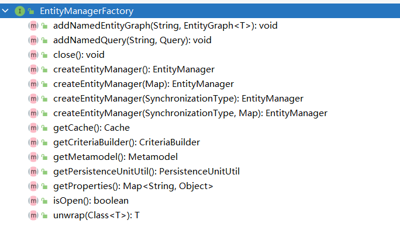

# README

[尚硅谷jpa开发教程全套完整版](https://www.bilibili.com/video/BV1vW411M7zp) 源码，自用。

## reference

* [Jakarta Persistence 3.0 Specification Document](https://jakarta.ee/specifications/persistence/3.0/jakarta-persistence-spec-3.0.html)
* [Jakarta Persistence 3.0 Javadoc](https://jakarta.ee/specifications/persistence/3.0/apidocs)
* [Spring Data JPA - Reference Documentation](https://docs.spring.io/spring-data/jpa/docs/2.5.0/reference/html/#preface)
* [Java Persistence API - Oracle Software Downloads](http://download.oracle.com/otn-pub/jcp/persistence-2_1-fr-eval-spec/JavaPersistence.pdf)
* [Advanced Spring Data JPA - Specifications and Querydsl](https://spring.io/blog/2011/04/26/advanced-spring-data-jpa-specifications-and-querydsl)
* [JPA Criteria Queries](https://www.baeldung.com/hibernate-criteria-queries)
* [Using the Criteria API and Metamodel API to Create Basic Typesafe Queries](https://docs.oracle.com/javaee/6/tutorial/doc/gjivm.html)
* [@JoinColumn Annotation Explained](https://www.baeldung.com/jpa-join-column)
* [廖雪峰 jpa 介绍](https://www.liaoxuefeng.com/wiki/1252599548343744/1282383789686817)

## Intro

Java Persistence API 是 Sun 官方提出的 Java 持久化规范。

JPA 和 Hibernate 的关系：JPA 是规范（类似于 JDBC），Hibernate 是 JPA 的实现


## annotations

| Annotation                     | Desc                                     |        |
| ------------------------------ | ---------------------------------------- | ------ |
| `@Entity`                      | 表示该类为实体类，将映射到指定的数据库表 |        |
| `@Table(name="table_name")`    | 指定该类映射表的表名                     |        |
| `@Id`                          | 映射主键                                 |        |
| `@GeneratedValue(strategy="")` | 主键生成策略                             |        |
| `@Basic`                       | 字段的默认注解，如果没有，会自动添加     |        |
| `@Column`                      | 指定字段详细属性                         |        |
| `@Transient`                   | 表示不作映射，可以作用于成员变量和方法   | 暂时的 |
| `@Temporal`                    | 指定时间格式                             | 时间的 |

### @GeneratedValue

几个 strategy：

* IDENTITY：ID 自增长，MySQL，Oracle 不支持
* AUTO：啥也不填，JPA 自动选择合适的策略，默认选项
* SEQUENCE：通过序列产生主键，MySQL 不支持
* TABLE：通过表产生主键

### @Basic

```java
@Basic(fetch = FetchType.EAGER, optional = true)
private String email;
```

如果一个属性没有加任何注解，那么就会默认加上 basic 注解。

两个参数：

* fetch: 属性读取策略，EAGER vs LAZY ，饿汉式和懒汉式，默认是 EAGER
* optional：属性是否允许为 null，默认式 null

### @Column

几个参数：

* name: 指定列名
* length：指定长度
* nullable：是否允许为 null
* unique：是否 unique
* columnDefinition：表示该属性在数据库中的实际类型，JPA 无法判断 Date 要转成数据库的 Date，Time 还是 TIMESTAMP

String 类型默认映射成 varchar，如果要映射成特定数据库的 BLOB 或 TEXT，则需要指定 columnDefinition

### @Temporal

```
@Temporal(value=)
```

接受一个枚举类型，可选值有三个：

* DATE 年月日
* TIME 年月日 时分秒
* TIMESTAMP 兼容前两个

## jpa-api

Java EE 已经归 Jakarta 组织维护，所以 jakarta 完全兼容 JavaEE，Jakarta Persistence API 就是 JPA。

### Persistence


Persistence 的主要作用就是用来创建 EntityManagerFactory 的。

```java
String persistenceUnitName = "default";
Map<String, Object> properties = new HashMap<>();
properties.put("hibernate.format_sql", true);
EntityManagerFactory entityManagerFactory = Persistence.createEntityManagerFactory(persistenceUnitName, properties);
```

### EntityManagerFactory

jpa 连接池，也是一个接口。主要作用还是创建数据库连接。



```java
EntityManager entityManager = entityManagerFactory.createEntityManager();
// 重载的方法：map 用于提供 entityManager 的属性
EntityManager entityManager = entityManagerFactory.createEntityManager(map);
```

`close()` 后，`isOpen()` 方法测试回返回 false，其他方法不能调用，否则回导致 IllegalStateException 异常。

### EntityManager

接口。

**临时对象**：new 出来的无 id 的对象

**游离对象**：new 出来的有 id 的对象

**懒加载**：多次查询，对于不常用的级联数据不取出，等到要用的时候再取出。懒加载都设置了代理类。

**Eager加载**：一次 join 查询获取所有值

增 persist 删 remove 查 find/getReference

#### find / getReference / persist / remove / merge

```java
package top.wansho.jpa;

import org.junit.jupiter.api.AfterEach;
import org.junit.jupiter.api.BeforeEach;
import org.junit.jupiter.api.Test;
import top.wansho.jpa.helloworld.Customer;

import javax.persistence.EntityManager;
import javax.persistence.EntityManagerFactory;
import javax.persistence.EntityTransaction;
import javax.persistence.Persistence;

import static org.junit.jupiter.api.Assertions.*;

public class EntityManagerTest {

    private EntityManagerFactory entityManagerFactory;
    private EntityManager entityManager;
    private EntityTransaction entityTransaction;

    @BeforeEach
    public void init(){
        entityManagerFactory = Persistence.createEntityManagerFactory("default");
        entityManager = entityManagerFactory.createEntityManager();
        entityTransaction = entityManager.getTransaction();
        // 开启事务
        entityTransaction.begin();
    }

    @AfterEach
    public void destroy(){
        // 提交事务
        entityTransaction.rollback();
        System.out.println("entityTransaction is active? " + entityTransaction.isActive()); // true
//        entityTransaction.commit();
        System.out.println("entityTransaction is active? " + entityTransaction.isActive()); // false
        entityManager.close();
        entityManagerFactory.close();
    }

    @Test
    public void testFind(){
        // 类似于 Hibernate 中的 get 方法，获取 id 为 1 的记录
        Customer customer = entityManager.find(Customer.class, 1);
        System.out.println("-------------------------");
        System.out.println(customer);
        // 先打印查询语句，再打印 --，饿汉式
    }

    @Test
    public void testGetReference(){
        // 类似于 Hibernate 中的 load 方法
        Customer customer = entityManager.getReference(Customer.class, 1); // 只获取引用
        System.out.println(customer.getClass().getName()); // top.wansho.jpa.helloworld.Customer$HibernateProxy$GLVOzPIc
        System.out.println("-------------------------");
        System.out.println(customer);
        // 先打印 --，再打印查询语句，懒加载，懒汉式，customer 是一个代理对象
    }

    @Test
    public void testPersist(){
        // 类似于 Hibernate 的 save 方法，使对象由临时状态变为持久化状态
        // 和 Hibernate 的 save 方法有些许不同，如果对象有 id，则不能执行 insert 操作，而会抛出异常
        Customer customer = new Customer();
        customer.setAge(13);
        customer.setEmail("wansho@163.com");
        customer.setLastName("www");
        entityManager.persist(customer);
        System.out.println(customer.getId()); // 有 id 了
    }

    @Test
    public void testRemove(){
        // 类似于 Hibernate 的 delete 对象，把对象对应的记录从数据库中移除
        // 注意：该方法只能移除持久化对象，而 hibernate 的 delete 方法实际上还可以移除游离对象
//        Customer customer = new Customer();
//        customer.setId(1); // 还是因为代理类的原因，不能删除游离对象
        Customer customer = entityManager.find(Customer.class, 1);
        entityManager.remove(customer);
    }

    @Test
    public void testMerge1(){
        // 1. 测试临时对象
        // 如果传入一个临时对象（没有 id），会创建一个新的对象，把临时对象的属性复制到新的对象中，然后对新的对象执行持久化操作
        // 所以新的对象会有 id，而临时对象没有 id
        Customer customer = new Customer();
        customer.setEmail("hehe@gmail.com");
        customer.setAge(18);
        customer.setLastName("ww");

        Customer customer2 = entityManager.merge(customer);
        System.out.println(customer.getId()); // null
        System.out.println(customer2.getId()); // 有 id
    }

    @Test
    public void testMerge2(){
        // 2. 测试游离对象
        // 2.1 在 EntityManager 缓存中没有该对象
        // 2.2 在数据库中也没有对应的记录
        // 2.3 JPA 会创建一个新的对象，然后把当前游离对象的属性复制到新创建的对象中
        // 2.4 对新创建的对象执行 insert 操作
        Customer customer = new Customer();
        customer.setEmail("hehe@gmail.com");
        customer.setAge(18);
        customer.setLastName("ww");
        customer.setId(20);

        Customer customer2 = entityManager.merge(customer);
        System.out.println(customer.getId());  // 20
        System.out.println(customer2.getId()); // 6，新对象 的 id 自增，和写入的 id 不一样
    }

    @Test
    public void testMerge3(){
        // 3. 测试游离对象
        // 3.1 在 EntityManager 缓存中没有该对象
        // 3.2 在数据库中有对应的记录
        // 3.3 JPA 会查询对应的记录，然后返回该记录对应的对象，然后再把游离对象的属性复制到查询到的对象中
        // 3.4 对查询到的对象进行 update
        Customer customer = new Customer();
        customer.setEmail("ww@gmail.com");
        customer.setAge(18);
        customer.setLastName("ww");
        customer.setId(6);

        Customer customer2 = entityManager.merge(customer);
        System.out.println(customer2 == customer); // false
        System.out.println(customer.getId());  // 6
        System.out.println(customer2.getId()); // 6，新对象 的 id 自增，和写入的 id 不一样
    }

    @Test
    public void testMerge4(){
        // 4. 测试游离对象
        // 4.1 在 EntityManager 缓存有该对象
        // 4.2 JPA 会把游离对象的属性直接复制给缓存中的对象
        // 4.3 对缓存中的对象执行 update
        Customer customer = new Customer();
        customer.setEmail("ww@gmail.com");
        customer.setAge(18);
        customer.setLastName("ww");
        customer.setId(6);

        Customer customer2 = entityManager.find(Customer.class, 6);
        entityManager.merge(customer);
        System.out.println(customer2 == customer);
    }

    @Test
    public void testFlush(){
        // 同 Hibernate 中 session 的 flush 方法，强制写入数据库
        Customer customer = entityManager.find(Customer.class, 1);
        customer.setLastName("dd");
        entityManager.flush();
    }

    @Test
    public void testRefresh(){
        // 从数据库中读最新的数据，强制刷新
        Customer customer = entityManager.find(Customer.class, 2); // select 1
        customer = entityManager.find(Customer.class, 2); // jpa 有一级缓存，这条语句没有去数据库中查询
        entityManager.refresh(customer); // select 2
        // 一共执行了两条查询语句
    }

}
```

#### flush / setFlushMode / getFlushMode

强制将内存中的数据写入数据库，进行持久化。

#### refresh

强制刷新。将数据库中的持久化对象的值同步到实体对象上，即更新实例的属性值。

#### clear

Clear the persistence context, causing all managed entities to become detached.

清除持久上下文环境，断开所有关联的实体。

#### isOpen / getTransaction / close

#### createQuery

类似的接口都是用来做 jpql 查询的。

### EntityTransaction

```java
@BeforeEach
    public void init(){
        entityManagerFactory = Persistence.createEntityManagerFactory("default");
        entityManager = entityManagerFactory.createEntityManager();
        entityTransaction = entityManager.getTransaction();
        // 开启事务
        entityTransaction.begin();
    }

    @AfterEach
    public void destroy(){
        
        entityTransaction.rollback();  // 回滚事务
//        entityTransaction.commit(); // 提交事务
        System.out.println("entityTransaction is active? " + entityTransaction.isActive()); // false
        entityManager.close();
        entityManagerFactory.close();
    }
```

事务，要么提交，要么回滚，不能同时存在。提交或回滚后，事务就 isNotActive 了。

## foreign key

### OneToOne


### 单向 ManyToOne


### 单向 OneToMany


### 双向 OneToMany

注意

* 双向 OneToMany 和 双向 ManyToOne 是一样的
* 双向的列名外键的 name 要保持一致
* 如果在 1 的一端 `@OneToMany` 中使用了 `mapperBy` 属性，则 `@OneToMany` 端就不能再使用 `@JoinColumn` 属性


### 双向 ManyToMany

必须指定一个关系维护端（Owner Side 中间表），可以通过 `@ManyToMany` 注释中指定 `mappedBy` 属性来标识其为关系维护端。


## JPQL: Java Persistence Query Language

### Query Interface

Interface used to control query execution.

Query 接口封装了执行数据库查询的相关方法。

获取 Query 对象的方法，是调用 EntityManager 的 createQuery，createNamedQuery，createNativeQuery 方法获取查询对象。

详细的 Query Language 语法和例子，参考 [Jakarta Persistence] 的第四章，Query Language。

```
A select statement is a string which consists of the following clauses:
• a SELECT clause, which determines the type of the objects or values to be selected.
• a FROM clause, which provides declarations that designate the domain to which the expressions
specified in the other clauses of the query apply.
• an optional WHERE clause, which may be used to restrict the results that are returned by the
query.
• an optional GROUP BY clause, which allows query results to be aggregated in terms of groups.
• an optional HAVING clause, which allows filtering over aggregated groups.
• an optional ORDER BY clause, which may be used to order the results that are returned by the
query.
```


## hibernate-criteria-queries

### maven

```xml
<dependency>
    <groupId>org.hibernate</groupId>
    <artifactId>hibernate-core</artifactId>   
    <version>5.3.2.Final</version>
</dependency>
```

### example using criteria

```java
public class Item implements Serializable {

    private Integer itemId;
    private String itemName;
    private String itemDescription;
    private Integer itemPrice;

   // standard setters and getters
}


Session session = HibernateUtil.getHibernateSession();
CriteriaBuilder cb = session.getCriteriaBuilder();
CriteriaQuery<Item> cr = cb.createQuery(Item.class);
Root<Item> root = cr.from(Item.class);
cr.select(root);

Query<Item> query = session.createQuery(cr);
List<Item> results = query.getResultList();
```

#### Using Expressions

To get items having a price of more than 1000:

```java
cr.select(root).where(cb.gt(root.get("itemPrice"), 1000));
```

Next, getting items having *itemPrice* less than 1000:

```java
cr.select(root).where(cb.lt(root.get("itemPrice"), 1000));
```

Items having *itemName* contain *Chair*:

```java
cr.select(root).where(cb.like(root.get("itemName"), "%chair%"));
```

Records having *itemPrice* in between 100 and 200:

```java
cr.select(root).where(cb.between(root.get("itemPrice"), 100, 200));
```

Items having *itemName* in *Skate Board, Paint* and *Glue*:

```java
cr.select(root).where(root.get("itemName").in("Skate Board", "Paint", "Glue"));
```

To check if the given property is null:

```java
cr.select(root).where(cb.isNull(root.get("itemDescription")));
```

To check if the given property is not null:

```java
cr.select(root).where(cb.isNotNull(root.get("itemDescription")));
```

**chain expressions**:

```java
Predicate[] predicates = new Predicate[2];
predicates[0] = cb.isNull(root.get("itemDescription"));
predicates[1] = cb.like(root.get("itemName"), "chair%");
cr.select(root).where(predicates);
```

To add two expressions with logical operations:

```java
Predicate greaterThanPrice = cb.gt(root.get("itemPrice"), 1000);
Predicate chairItems = cb.like(root.get("itemName"), "Chair%");
```

Items with the above-defined conditions joined with *Logical OR*:

```java
cr.select(root).where(cb.or(greaterThanPrice, chairItems));
```

To get items matching with the above-defined conditions joined with *Logical AND*:

```java
cr.select(root).where(cb.and(greaterThanPrice, chairItems));
```

#### sorting

```java
cr.orderBy(  cb.asc(root.get("itemName")),   cb.desc(root.get("itemPrice")));
```

#### projections, aggregates, and grouping functions

**count**

```java
CriteriaQuery<Long> cr = cb.createQuery(Long.class);Root<Item> root = cr.from(Item.class);cr.select(cb.count(root));Query<Long> query = session.createQuery(cr);List<Long> itemProjected = query.getResultList();
```

***Aggregate* function for Average**

```java
CriteriaQuery<Double> cr = cb.createQuery(Double.class);Root<Item> root = cr.from(Item.class);cr.select(cb.avg(root.get("itemPrice")));Query<Double> query = session.createQuery(cr);List avgItemPriceList = query.getResultList();
```

Other useful aggregate methods that are available are *sum()*, *max()*, *min()* **,** *count()* etc.

## Specifications

Specification 是 Spring 框架的一部分，是 Spring 对 Criteria API （root，criteria）的封装

JPA 2 introduces a criteria API that you can use to build queries programmatically. By writing a `criteria`, you define the **where clause** of a query for a domain class. Taking another step back, these criteria can be regarded as a **predicate** over the entity that is described by the JPA criteria API constraints.

The **power of specifications** really shines when you combine them to create new `Specification` objects.

`Specification` offers some “glue-code” default methods to chain and combine `Specification` instances. These methods let you extend your data access layer by creating new `Specification` implementations and combining them with already existing implementations.

Although this approach（直接按照规则写接口，不实现的方式） is really convenient (you don’t even have to write a single line of implementation code to get the queries executed) it has two drawbacks: first, the number of query methods might grow for larger applications because of - and that’s the second point - the queries define a fixed set of criterias. To avoid these two drawbacks, wouldn’t it be cool if you could come up with a set of atomic predicates that you could combine dynamically to build your query?

想要引入 Specifications 特性，必须继承 `JpaSpecificationExecutor` 接口。

**Specification** 是一个函数式接口

```java
public interface Specification<T> {  Predicate toPredicate(Root<T> root, CriteriaQuery<?> query,            CriteriaBuilder builder);}
```

Demo: Specifications for a Customer

```java
public class CustomerSpecs {  public static Specification<Customer> isLongTermCustomer() {    return (root, query, builder) -> {      LocalDate date = LocalDate.now().minusYears(2);      return builder.lessThan(root.get(Customer_.createdAt), date);    };  }  public static Specification<Customer> hasSalesOfMoreThan(MonetaryAmount value) {    return (root, query, builder) -> {      // build query here    };  }}
```

```java
// Using a simple SpecificationList<Customer> customers = customerRepository.findAll(isLongTermCustomer());// Combined SpecificationsMonetaryAmount amount = new MonetaryAmount(200.0, Currencies.DOLLAR);List<Customer> customers = customerRepository.findAll(  isLongTermCustomer().or(hasSalesOfMoreThan(amount)));
```

Another Demo：

```java
private Specification<EntityGraph> getSpecification(PageBean pageBean) {        return (root, query, criteriaBuilder) -> {            List<Predicate> predicateList = new ArrayList<>();            if(StringUtils.isNotEmpty(pageBean.getFilterValue())){                predicateList.add(criteriaBuilder.equal(root.get(DEFAULT_FILTER_FIELD), pageBean.getFilterValue()));            }            return criteriaBuilder.and(predicateList.toArray(new Predicate[0]));        };    }
```

root 负责取成员变量，query 是 CriteriaQuery 类型，负责生成 root，criteriaBuilder 是 CriteriaBuilder 类型

## jpa 实现

### Hibernate

常见配置：

```yml
jpa:    database: mysql    show-sql: true    properties:      hibernate:        hbm2ddl:          # 自动更新维护表结构          auto: update        dialect: org.hibernate.dialect.MySQL55Dialect        format_sql: true # 对 sql 进行格式化    open-in-view: false
```

## join in jpa


